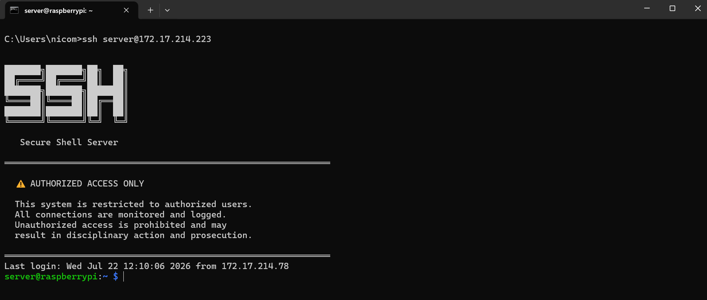
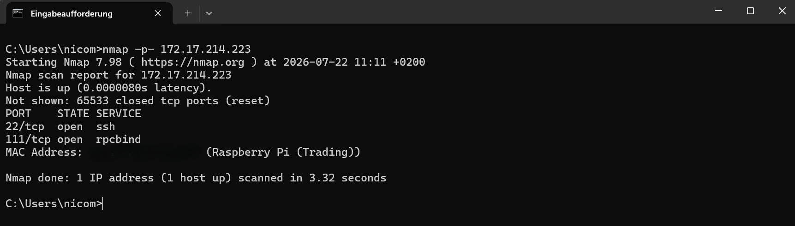
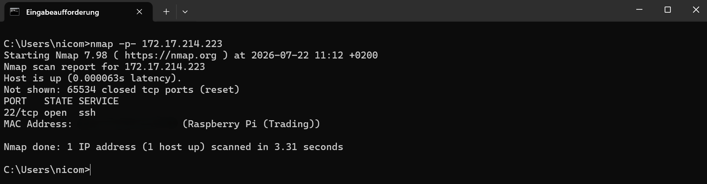
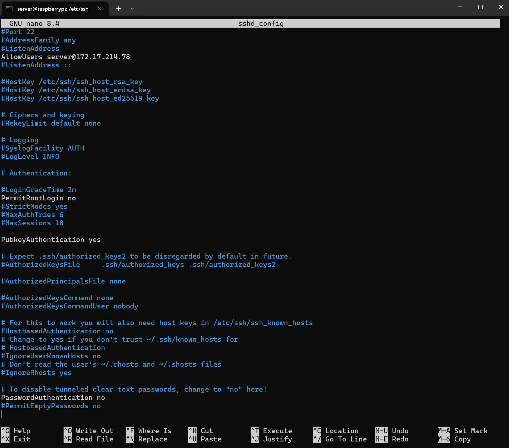
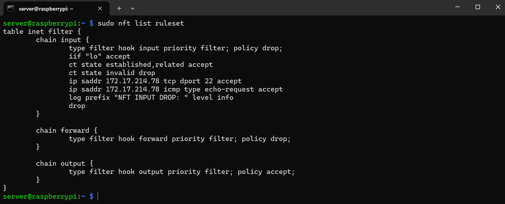
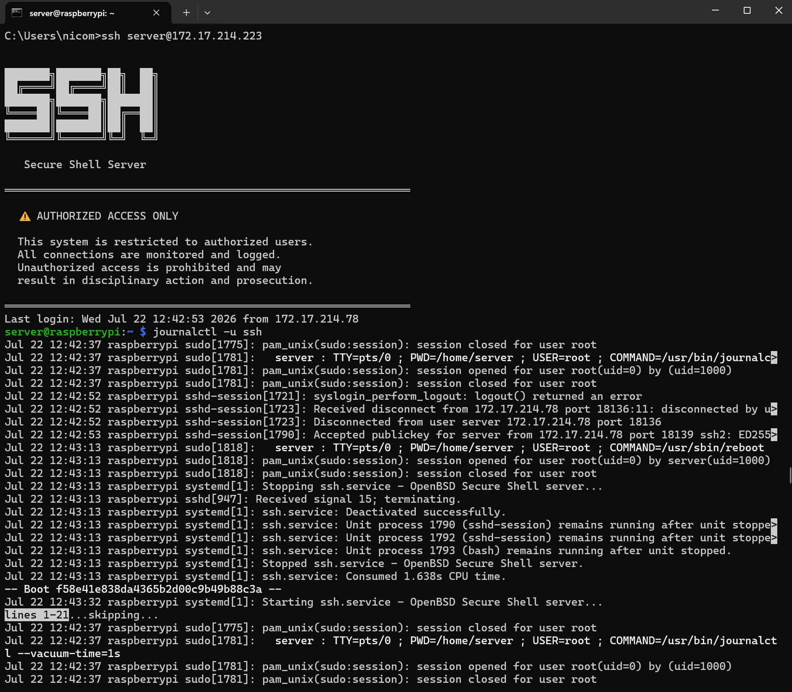
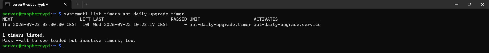

# Raspberry Pi SSH Server

Absicherung eines SSH-Zugangs auf einem Raspberry Pi – ein praktisches Lab-Projekt zu Linux-Grundlagen, SSH-Härtung und Netzwerksicherheit.

## Was wurde gebaut

Ein Raspberry Pi mit einem gehärteten SSH-Server als Basis für einen sicheren Remote-Zugriff. Ausgangspunkt war eine Standard-SSH-Installation mit Passwort-Login, offenen ungenutzten Diensten und ohne Firewall – Ziel war es, die Angriffsfläche systematisch auf das Minimum zu reduzieren, das für den eigentlichen Zweck tatsächlich gebraucht wird. Der Zugriff erfolgt ausschließlich per Public-Key-Authentifizierung, ein Passwort-Login ist nicht mehr möglich.

## Systemumgebung

- Server: Raspberry Pi 5 2 GB RAM, Raspberry Pi OS
- Client: ThinkPad E16 32 GB RAM, Windows 11 Pro

## Konfigurationsartefakte

- SSH-Konfiguration: `/etc/ssh/sshd_config`
- Login-Banner: `/etc/ssh/banner.txt`
- Firewall: `nftables`, Konfiguration unter `/etc/nftables.conf`
- Persistentes Logging: `/etc/systemd/journald.conf.d/99-persistent.conf`

## Durchgeführte SSH-Härtung

Im Rahmen der SSH-Härtung wurden mehrere nicht benötigte bzw. unsichere Zugriffsmöglichkeiten deaktiviert. Dazu gehören die Abschaltung des direkten Root-Logins, die Deaktivierung der PAM-Authentifizierung sowie die Einschränkung des SSH-Zugriffs auf die eigene IP-Adresse. Dadurch sind ausschließlich explizit erlaubte Verbindungen mit dem vorgesehenen Authentifizierungsverfahren möglich.

### SSH-Schlüsselpaar

Das SSH-Schlüsselpaar wurde auf dem Client-System erzeugt und anschließend nur der öffentliche Schlüssel auf den Raspberry Pi übertragen. Der private Schlüssel verblieb ausschließlich auf dem Client-System und wurde zu keinem Zeitpunkt auf den Raspberry Pi übertragen.

Verwendeter Algorithmus:

- `ed25519` (moderner elliptischer Kurvenalgorithmus)
- Privater Schlüssel: `id_ed25519`
- Öffentlicher Schlüssel: `id_ed25519.pub`

## Netzwerksicherheit

Zur Analyse der Angriffsfläche wurde zunächst ein Portscan mit `nmap` durchgeführt. Dabei wurden die erreichbaren Netzwerkdienste identifiziert.

Der dabei erkannte, nicht benötigte Dienst `rpcbind` auf Port `111` wurde anschließend gestoppt und deaktiviert.

Durch die Entfernung nicht benötigter Dienste wurde die Anzahl potenzieller Angriffspunkte auf dem System reduziert.

## Firewall (nftables)

Zusätzlich zur SSH-seitigen Absicherung wurde eine eigene Firewall mit `nftables` aufgesetzt, um den eingehenden Traffic auf Netzwerkebene zu kontrollieren:

- Standard-Policy für die Input-Chain auf `drop` gesetzt – alles, was nicht explizit erlaubt ist, wird verworfen
- Loopback-Traffic sowie bereits etablierte und zugehörige Verbindungen erlaubt, ungültige Pakete verworfen
- Nur der SSH-Port explizit freigegeben, ergänzend auf die eigene IP-Adresse eingeschränkt
- ICMP (Ping) gezielt erlaubt, aber ebenfalls auf die eigene IP-Adresse eingeschränkt, um die Erreichbarkeit weiterhin testen zu können
- Jeglicher verworfener eingehender Traffic wird zusätzlich protokolliert (`log prefix "NFT INPUT DROP:"`), bevor er verworfen wird – dadurch ist nachvollziehbar, welche Verbindungsversuche von der Firewall abgewiesen wurden

## SSH-Zugriff

Beim Verbindungsaufbau wird ein individuelles Login-Banner angezeigt, das noch vor der Authentifizierung erscheint und auf autorisierten Zugriff sowie Logging hinweist.

## Monitoring & Logging

SSH-Login-Versuche werden über das systemd-Journal nachvollzogen – sowohl erfolgreiche als auch fehlgeschlagene Verbindungsversuche werden protokolliert.

In Kombination mit dem Logging verworfener Pakete auf Firewall-Ebene ergibt sich damit Sichtbarkeit auf zwei Ebenen: Was hat die Firewall abgewiesen und wer hat sich tatsächlich am SSH-Dienst authentifiziert.

Raspberry Pi OS bringt seit Bookworm kein `rsyslog` mehr mit, klassische Textlogs wie `/var/log/auth.log` existieren daher nicht mehr – Logging läuft vollständig über `journald`.

**Problem:** Standardmäßig speichert Raspberry Pi OS die Journal-Logs nur im RAM (`Storage=volatile`), wodurch sämtliche Logs bei jedem Reboot verloren gehen. Ursache ist eine mitgelieferte Systemkonfiguration unter `/usr/lib/systemd/journald.conf.d/40-rpi-volatile-storage.conf`, die diesen Modus fest vorgibt und eigene Änderungen in der Haupt-Config (`/etc/systemd/journald.conf`) überstimmt.

**Lösung:** Eine eigene Drop-in-Konfiguration unter `/etc/systemd/journald.conf.d/99-persistent.conf` überschreibt gezielt nur diese eine Einstellung, ohne die Raspberry-Pi-eigene Datei zu verändern.

Nach Neustart von `systemd-journald` bleiben die Logs dauerhaft über Reboots hinweg erhalten.

**Speicherplatz:** Da die Logs nun dauerhaft auf der SD-Karte gespeichert werden, sollte die maximale Größe des Journals kontrolliert und bei Bedarf begrenzt werden. Dies kann beispielsweise über Größen- oder Zeitlimits in der Journald-Konfiguration erfolgen.

## Automatische Sicherheitsupdates

Zur regelmäßigen Installation sicherheitsrelevanter Updates wurde unter Raspberry Pi OS `unattended-upgrades` eingerichtet.

Die automatische Aktualisierung wurde so konfiguriert, dass das System täglich um **03:00 Uhr** nach Sicherheitsupdates sucht und diese eigenständig installiert. 

## Bewusster Verzicht auf fail2ban

`fail2ban` wurde in Betracht gezogen, letztlich aber bewusst nicht eingesetzt. Der Grund: Brute-Force-Schutz durch IP-Sperrung nach fehlgeschlagenen Login-Versuchen adressiert primär das Szenario Passwort-Login von beliebigen IPs aus – genau dieser Angriffsvektor ist hier aber bereits auf zwei unabhängigen Ebenen ausgeschlossen:

- **Firewall-Ebene (nftables):** Nur die eigene IP darf den SSH-Port überhaupt erreichen, alle anderen Verbindungsversuche werden verworfen, bevor sie den SSH-Dienst erreichen
- **Anwendungsebene (sshd_config):** Zusätzlich per `AllowUsers` auf dieselbe IP beschränkt, außerdem ausschließlich Public-Key-Authentifizierung, Passwort-Login ist komplett deaktiviert

Ein Angreifer müsste demnach nicht nur die Firewall umgehen und die eigene IP-Adresse vortäuschen, sondern zusätzlich einen gültigen privaten Schlüssel kompromittieren – ein Szenario, gegen das Rate-Limiting durch fail2ban keinen relevanten zusätzlichen Schutz bietet.

Hier wurde bewusst eine schlanke Sicherheitsarchitektur gewählt, bei der vorhandene Schutzmechanismen gezielt eingesetzt und zusätzliche Komponenten nur bei tatsächlichem Mehrwert hinzugefügt werden.

## Weitere Hardening-Maßnahmen und zukünftige Überlegungen

Die aktuelle Absicherung reduziert bereits die wesentlichen Angriffsflächen des Systems, insbesondere im Bereich SSH-Zugriff, Netzwerkfilterung und Logging. Für eine noch umfassendere Härtung des Raspberry Pi wären weitere Maßnahmen denkbar:

### Deaktivierung nicht benötigter Dienste

Nicht benötigte lokale Dienste sollten grundsätzlich deaktiviert oder entfernt werden, um die Anzahl potenziell angreifbarer Komponenten weiter zu reduzieren.

Beispiele:

- Deaktivierung ungenutzter Hardware-Dienste wie Bluetooth
- Abschalten nicht benötigter Druckdienste wie `CUPS`
- Entfernen oder Deaktivieren weiterer standardmäßig installierter Dienste, die für den Einsatzzweck nicht benötigt werden

Der Grundsatz lautet: Jeder aktive Dienst stellt eine zusätzliche Angriffsfläche dar und sollte nur betrieben werden, wenn er tatsächlich benötigt wird.

### Rechteverwaltung und Benutzerhärtung

Die Benutzer- und Rechteverwaltung könnte weiter eingeschränkt werden:

- Überprüfung bestehender Benutzerkonten
- Entfernung nicht benötigter Benutzer
- Minimierung von Gruppenmitgliedschaften
- Einschränkung von Dateirechten nach dem Prinzip der geringsten notwendigen Berechtigungen (`Least Privilege`)
- Prüfung und Absicherung von `sudo`-Berechtigungen

Ziel ist es, dass Benutzer und Prozesse nur die Rechte besitzen, die für ihre jeweilige Aufgabe erforderlich sind.

### Kernel-Härtung

Zusätzliche Schutzmaßnahmen auf Kernel-Ebene könnten die Systemsicherheit weiter erhöhen:

- Anpassung sicherheitsrelevanter Kernel-Parameter über `sysctl`
- Einschränkung von Netzwerkverhalten auf Kernel-Ebene
- Aktivierung zusätzlicher Schutzmechanismen gegen bestimmte Angriffstechniken
- Prüfung geladener Kernel-Module und Deaktivierung nicht benötigter Komponenten

### Regelmäßige Sicherheitsüberprüfungen

Zur regelmäßigen Bewertung des Sicherheitszustands können zusätzliche Auditing-Werkzeuge eingesetzt werden.

Beispiele:

- `Lynis` zur Durchführung von System-Sicherheitsaudits
- erneute Portscans mit `nmap` zur Überprüfung der erreichbaren Dienste
- Analyse von System- und Authentifizierungslogs
- Überprüfung der Firewall-Regeln und SSH-Konfiguration nach Änderungen

Regelmäßige Audits helfen dabei, neue Fehlkonfigurationen frühzeitig zu erkennen und die Sicherheit des Systems langfristig aufrechtzuerhalten.

## Screenshots

**Login-Banner**

**nmap-Scan vorher**

**nmap-Scan nachher**

**SSH-Konfigurationsausschnitt**

**nftables-Regeln**

**Persistentes Logging**

**Systemd-Timer für automatische Sicherheitsupdates**

